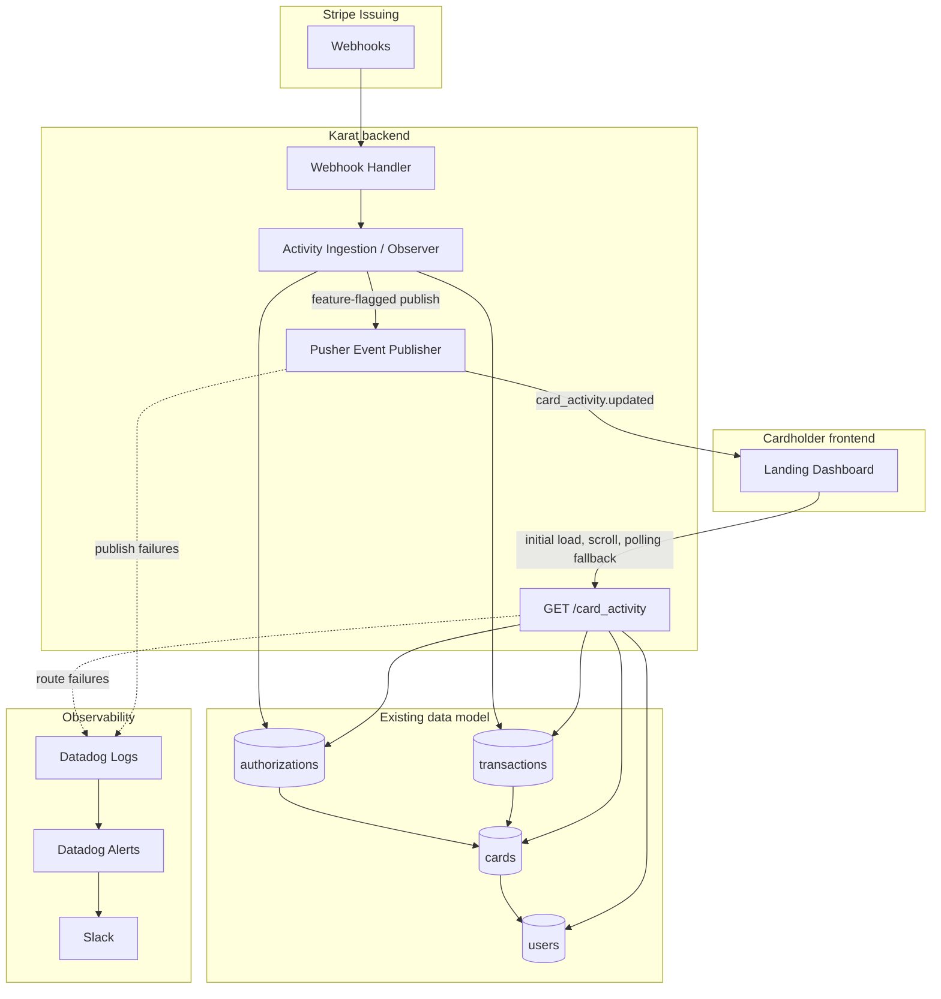

# Card Activity & Insights - Engineering Design Doc

**Author:** Moshood Sikiru  
**Status:** Review  
**Date:** 05/21/2026 (Thur)

## Introduction

### Problem statement

Cardholders need a **first-login landing page** that answers three questions quickly:

1. **What happened?** - A chronological activity feed of card spend (pending authorizations and settled transactions).
2. **How am I doing?** - A small set of MTD summary metrics (total spend, total pending txns, top category spend).
3. **Where did it go?** - A lightweight spend breakdown by **merchant category** (Stripe `merchant_data.category`).

Data should stay **reasonably fresh** as new activity occurs, without requiring the user to manually refresh.

### Goal of this deliverable

This doc covers **v1** of the dashboard: product scope, architecture, data model, APIs, freshness strategy, and rollout. Implementation is scoped to:

- **Reuse** the existing Karat ↔ Stripe Issuing integration data
- **Add** a cardholder-facing landing page (frontend).
- **Add** backend read APIs and aggregation for activity + insights.
- **Insights** are limited to month-to-date (MTD) for better performance.

### Supported insights in v1

The landing page summary supports these MTD insights:


| Insight            | Scope | Example                |
| ------------------ | ----- | ---------------------- |
| Total pending txns | MTD   | `3`                    |
| Total spend        | MTD   | `$12.5k USD`           |
| Top category spend | MTD   | `Software ($4.2k USD)` |


### Out of scope for v1 (see Constraints)

- Statements export, multi-card portfolio analytics & Spend projections / recommendations
- Insight period filters, custom date ranges, and multi-card selection (future)

### Product references


| Resource                       | Link                                                                                                     |
| ------------------------------ | -------------------------------------------------------------------------------------------------------- |
| Stripe Issuing: Cards          | [https://stripe.com/docs/api/issuing/cards](https://stripe.com/docs/api/issuing/cards)                   |
| Stripe Issuing: Authorizations | [https://stripe.com/docs/api/issuing/authorizations](https://stripe.com/docs/api/issuing/authorizations) |
| Stripe Issuing : Transactions  | [https://stripe.com/docs/api/issuing/transactions](https://stripe.com/docs/api/issuing/transactions)     |
| Stripe Webhooks                | [https://stripe.com/docs/webhooks](https://stripe.com/docs/webhooks)                                     |


## Assumptions


| #   | Assumption                                                                                                                                 |
| --- | ------------------------------------------------------------------------------------------------------------------------------------------ |
| A1  | Karat already integrates with **Stripe Issuing** (API keys, webhook endpoint, card ↔ user mapping).                                        |
| A2  | Card authorizations and transactions are already persisted to the database.                                                                |
| A3  | Each cardholder has one active card.                                                                                                       |
| A4  | “Reasonably fresh” means Pusher delivers near-real-time freshness when available; polling and page reload recover from missed push events. |
| A5  | Amounts are stored and returned in **minor units** (cents); display currency matches the card’s `currency`.                                |
| A6  | Merchant category for breakdown comes from Stripe `merchant_data.category` (fallback: `Uncategorized`).                                    |
| A7  | Insights (metrics + spend by category) are scoped to **month-to-date (MTD)** for v1.                                                       |


## Constraints / Limitations

- **Not** a source of truth for ledger/settlement; Stripe + existing finance systems remain authoritative.
- **No** cross-processor support; Stripe Issuing only.
- Breakdown is **by category only** in v1
- Insights are **MTD only** in v1; future work may add period filters and card selection.

## Potential Solutions

### Context: what we already have vs what we build


| Layer                  | Existing | New in v1                                                |
| ---------------------- | -------- | -------------------------------------------------------- |
| Stripe webhooks / data | Yes      | Extend observer to publish activity events after persist |
| Landing UI             | No       | Activity feed + metrics + breakdown                      |
| Card activity API      | No       | Single REST read endpoint (`card_activity`)              |
| Freshness to browser   | No       | Pusher preferred; polling fallback                       |


### Freshness: Polling vs Event Based

Stripe pushes to **our** backend via webhooks. The browser still needs a way to learn about new rows. Pusher is the preferred option for v1 freshness; polling remains the fallback and recovery path.


| Approach                                                                                          | Pros                                                    | Cons                                            | Effort     | Recommendation |
| ------------------------------------------------------------------------------------------------- | ------------------------------------------------------- | ----------------------------------------------- | ---------- | -------------- |
| **Polling** -> `GET /card_activity?since=<cursor>` on an interval (e.g. 30s)                      | No new vendors; easy to debug; single roundtrip         | Extra read load when idle, up to ~30s staleness | Low        | Fallback       |
| **Events (Pusher)** -> Backend triggers `card_activity.updated`; frontend fetches `card_activity` | Near-real-time UX; no self-hosted pub/sub; no new infra | Third-party dependency                          | Low-Medium | Preferred      |


Use Pusher to notify the client when new activity is persisted, then fetch the latest feed delta and **MTD summary** via `GET /card_activity?since=<cursor>`.

**Pros:** Fire-and-forget push; near-real-time UX; no self-hosted WebSocket cluster to operate.  
**Cons:** Vendor outage or client offline can miss push events, so the client should still refresh on page load and fall back to polling.

## System Design and Architecture

### High-level architecture




### Component terminology


| Term               | Meaning                                                                     |
| ------------------ | --------------------------------------------------------------------------- |
| **Activity item**  | Normalized row: authorization and/or transaction, unified for feed display  |
| **Posted**         | Settled `issuing.transaction`                                               |
| **Pending**        | Open or approved `issuing.authorization` not yet fully captured/voided      |
| **Cursor**         | Opaque pagination token (`createdAt`, `id`) for feed                        |
| **MTD**            | Month-to-date: from the first day of the current calendar month through now |
| **Summary**        | MTD aggregates: metrics + spend by category (insights)                      |
| **MCC / category** | `merchant_data.category` from Stripe                                        |


### Hard and soft dependencies


| Dependency      | Type                     | Impact if down                                                    |
| --------------- | ------------------------ | ----------------------------------------------------------------- |
| Stripe webhooks | Hard (ongoing freshness) | Stale feed until reconcile; show banner “activity may be delayed” |
| App DB          | Hard                     | Dashboard unavailable                                             |
| Pusher          | Soft                     | Degrade to polling / manual refresh                               |


### Service guarantees


| Guarantee           | v1 target                                                                                                                  |
| ------------------- | -------------------------------------------------------------------------------------------------------------------------- |
| Read API / recovery | **Eventually consistent** with backend in cases of any outages; metrics will auto-update when backend service is restored. |
| ACID                | Existing authorization/transaction writes remain transactional; summary reads can be derived query-time.                   |


### Data modeling

The dashboard should primarily reuse the existing Issuing data model instead of introducing a new activity source of truth. Expected existing tables and relationships:


| Table            | Relationship / purpose                                  | Relevant columns                                                                                                               |
| ---------------- | ------------------------------------------------------- | ------------------------------------------------------------------------------------------------------------------------------ |
| `users`          | Owns cardholder identity                                | `id`, `name`, `email`, `createdAt`, `updatedAt`                                                                                |
| `cards`          | Links issued card to `users`                            | `id`, `apiId`, `userId`, `last4`, `currency`, `status`, `createdAt`, `updatedAt`                                               |
| `authorizations` | Stores pending/approved/declined Issuing authorizations | `id`, `apiId`, `cardId`, `amount`, `currency`, `status`, `merchantName`, `merchantCategory`, `createdAt`, `updatedAt`          |
| `transactions`   | Stores posted Issuing transactions; links back to auth  | `id`, `apiId`, `authorizationId`, `cardId`, `amount`, `currency`, `merchantName`, `merchantCategory`, `createdAt`, `updatedAt` |


The `GET /card_activity` response is a read model over these existing tables:

- Activity feed combines authorizations and transactions into a single display list.
- Posted transactions can link back to the originating authorization for dedupe/display.
- Pending items come only from open authorizations. Posted items come from transactions, so the feed unions pending authorizations with posted transactions and avoids double-counting once an authorization has a transaction entry.
- User and card metadata, such as user name, email, and card last4, are joined from existing `users` and `cards` rows when needed.
- MTD summary metrics are computed from the same authorization/transaction data.

An optional materialized summary can be added only if query-time aggregation becomes a performance issue.

Recommended indexes: `cards(userId)`, `authorizations(cardId, createdAt DESC)`, `transactions(cardId, createdAt DESC)`, and optional summary index `(userId, periodStart)`.

### Caching

No caching in v1 by default. Query and result caching will be added **only if** we observe impending performance issues on read paths.

### Performance requirements


| Endpoint             | SLA (p95)                    |
| -------------------- | ---------------------------- |
| `GET /card_activity` | < 500ms (feed + MTD summary) |


One roundtrip: `card_activity` returns the paginated feed and **summary** (metrics + spend by category) for the landing page.

### Observability

Use **Datadog** to track logs, metrics and alerting.


| Area     | What we track                                                                                                                           | Alerting                                             |
| -------- | --------------------------------------------------------------------------------------------------------------------------------------- | ---------------------------------------------------- |
| Logs     | Track Pusher connectivity failure & `GET /card_activity` route failures with request id, user/card identifiers, status code, and reason | Searchable in Datadog for debugging incidents        |
| Metrics  | Track `GET /card_activity` response durations with p50/p95/p99 latency and status-code tags                                             | Alert when p95 duration exceeds the 500ms API Service Level Objective(SLO)    |
| Alerting | Threshold-based alerts for activity route failures and Pusher API failures                                                              | Notify on Slack channel when thresholds are breached |


Pusher publish failures should be logged without blocking webhook persistence. Alerts should make failures visible quickly, while the client can still recover through page reload or polling fallback.

### Security

Re-uses **existing system access security** on the backend (session/auth, webhook signature verification). `GET /card_activity` must derive the cardholder from the authenticated session and filter reads to cards owned by that user. Pusher should use private, user-scoped channels so a cardholder only receives activity events for their own card.

### Multi-region

Re-uses the **existing system availability strategy** (deployment topology, DR, and scaling) — no separate multi-region design for this feature in v1.

## API Endpoints

### `GET /card_activity`

Single endpoint for the landing page: activity feed + **MTD summary** (insights).

Summary spend excludes declined authorizations and uses posted transactions for settled spend.

Query: `cursor`, `limit` (default 10, max 50), optional `since` (timestamp for delta poll on the feed).

Cursor pagination:

- Initial page load requests `GET /card_activity?limit=10` and returns the 10 most recent activity items.
- Response includes `next_cursor`, derived from the last item in the page, e.g. `{ displayAt, id }`.
- When the user scrolls, the frontend calls `GET /card_activity?limit=10&cursor=<next_cursor>` to fetch the next older page.
- The backend queries activity ordered by `displayAt DESC, id DESC` and returns rows after the cursor boundary.
- If `next_cursor` is `null`, there are no more older rows to load.

I'm choosing cursor pagination here over offset/page-number pagination because new activity can arrive while the user is scrolling given spend nature. Offsets can shift when new rows are inserted, causing duplicate or skipped items.

Sample Dummy Response:

```json
{
  "items": [
    {
      "id": "uuid",
      "kind": "authorization",
      "status": "pending",
      "amount": -4500,
      "currency": "usd",
      "merchant_name": "Shell",
      "merchant_category": "gas_stations",
      "display_at": "2026-05-21T14:32:00Z"
    }
  ],
  "next_cursor": "...",
  "summary": {
    "period": { "start": "2026-05-01", "end": "2026-05-21", "scope": "mtd" },
    "metrics": {
      "total_spend": 125000,
      "total_pending_txns": 3,
      "top_category_spend": {
        "category": "software",
        "amount": 420000,
        "currency": "usd"
      },
      "currency": "usd"
    },
    "breakdown_by_category": [
      { "category": "gas_stations", "amount": 32000, "percent": 25.6 },
      { "category": "restaurants", "amount": 28000, "percent": 22.4 }
    ]
  }
}
```

**Future:** optional query params for period filters and card selection; v1 is MTD + default card only.

## Rollout Plan

- **Backend event publishing:** Add environment variable (e.g. `ACTIVITY_EVENT_PUBLISH_ENABLED`) to feature-flag optional event publishing after ingest. Default on in production; can be turned **off** quickly if publishing causes issues.
- **Frontend activity page:** Feature-flag the new landing page if feature flagging is available; release to **internal users only** first, then roll out incrementally (**% based**) or to **all users** after validation.

## Test Plan


| Area        | Approach                                                                                                      |
| ----------- | ------------------------------------------------------------------------------------------------------------- |
| Integration | Verify `GET /card_activity` returns only the authenticated cardholder's card data, cursor pagination works, and MTD computations are correct. |
| Realtime    | Verify Pusher update events trigger a feed refresh and polling/page reload recovers when Pusher is unavailable. |
| E2E         | Staging manual E2E test for initial load, scrolling, pending vs posted display, and empty/error states.        |


## Frontend (landing page) — brief UX spec

Prototype: [Card Activity & Insights - KARAT](https://dough-data-zen.lovable.app/)

- **Stack:** React/Next landing page.
- **State:** React Query (or SWR) for a single `GET /card_activity`; metrics and breakdown from `summary`; subscribe to Pusher for freshness and fall back to polling with `since` for feed deltas.
- **Empty / error:** Skeleton loaders for initial load; clear empty and error states when activity data is unavailable.

## Appendix

### Stripe webhook types (minimum)

- `issuing_authorization.created`
- `issuing_authorization.updated`
- `issuing_transaction.created`

### Spike notes (feasibility)

Feature would be implementable with the existing webhook ingestion path and local activity store.


| Question                                    | Result                                                                                                          |
| ------------------------------------------- | --------------------------------------------------------------------------------------------------------------- |
| Can we reuse existing Stripe webhook route? | Yes - Just add an observer at the transaction or authorization ingestion layer to asynchronously publish updates |
| Poll Stripe vs local store?                 | Local store only for dashboard reads                                                                            |


### References

- [Stripe Issuing Webhooks](https://stripe.com/docs/issuing)

